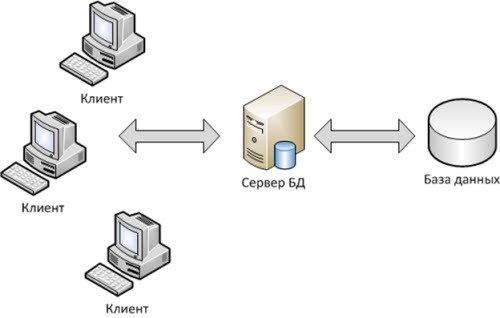

Тема проекта: Исследование особенностей организации процесса ручного тестирования веб-приложениz в условиях отсутствия технического задания на примере тестирования интернет-магазина.
Цель: Изучить особенности ручного тестирования веб-приложения в условиях отсутствия спецификации к программному продукту и разработать предложения по улучшению процесса ручного тестирования веб-приложения Lamoda.

Задачи:
1.Изучить источники литературы в сфере тестирования веб-прмложений;

2.Ознакомиться с основными видами и методами ручного тестирования веб-приложений;

3.Изучить правила и принципы составления тестовой документации (чек-листы, тест-кейсы, тест-планы, баг-репорты);

4.Изучить техники тест-дизайна и их применение при тестировании веб-приложения;

5.Выполнить ручное тестирование веб-приложения Lamoda;

6.Разработать предложения по улучшению процесса ручного тестирования веб-приложения Lamoda.

Инструменты: Postman, Qase.io, Jira, DevTools, Git, TestRail.

Структура дипломного проекта:

Оглавление

Введение (2-3 стр)

Глава 1. Ручное тестирование веб-приложений и его основные принципы (~15 стр)

1.1 Что такое веб-приложение, его особенности

1.2 Что такое тестирование. Зачем нужно тестирование и кто его проводит

1.3 Этапы ручного тестирования веб-приложений

1.4 Что такое техническое задание и как проводить ручное тестирование, если техническое задание отсутствует

Глава 2. Подготовка к ручному тестированию веб-приложения (~15 стр)

2.1 Составление чек-листов

2.2 Составление тест-кейсов

2.3 Составление тест-плана

2.4 Текхники тест-дизайна 

2.5 Создание баг-репортов и понятие багтрекинговой системы

Глава 3. Проведение тестирования и разработка предложений по улучшению тестирования Интернет-магазина Lamoda (~20 стр)

3.1 Функциональное тестирование

3.2 Тестирование юзабилити

3.3 Тестирование интерфейса

3.4 Тестирование совместимости

3.5 Тестирование безопасности

3.6 Подведение итогов. Разработка предложений по улучшению ручного тестирования веб-приложения Lamoda

Заключение (~ 4 стр)

Список используемой литературы

Приложения

Введение

В наши дни такой вопрос как «Зачем нужен сайт?» задается все реже. Это неудивительно, ответ на него давно уже стал очевидным: сайт необходим для того, чтобы его владелец мог донести информацию до пользователей, и предоставить им возможность приобрести товар или услугу.
На сегодняшний день глобальная сеть является важнейшим информационным источником, а Web-сайт – основной ячейкой этого сложного механизма, полноценный источник информации в сети. Компании и пользователи все больше зависят от Web-приложений как в работе, так и в своей повседневной жизни. 
Важную роль в большинстве сфер бизнеса - Создание собственных Web-приложений. Число пользователей Web-приложениями постоянно растет по всему миру и исчисляется уже миллиардами. В современных условиях быстрого развития глобальной сети все больше владельцев сайтов задумывается об качестве, скорости, удобстве и модернизации, т.к. в современных реалиях необходимо заинтересовать и привлечь как можно большее количество пользователей. 
Web-приложения крайне динамичны и развиваются с каждым днем. Они могут приносить огромную прибыль и играют большую роль в продвижении бизнеса, так что конкуренция в этой сфере очень высока. Даже небольшие или несущественные ошибки, допущенные при разработке сайта, могут повлиять на выбор пользователя относительно того, какой из сервисов ему выбрать. Именно поэтому, тестирование играет одну из важнейших ролей в процессе создания и разработки Web-приложений. Именно поэтому я выбрала данную тему для своего дипломного проекта.
Целью моей работы является изучить особенности ручного тестирования веб-приложения и разработать предложения по улучшению процесса ручного тестирования веб-приложений. Для примера я взяла интернет-магазин Lamoda.
Главные задачи данного web-приложения:
	поддержка мобильных устройств;
	кроссбраузерность;
	быстрая загрузка;
	в удобном виде предоставлять всю необходимую информацию для пользователей;
	предоставить пользователям удобный интерфейс для совершения покупок онлайн;
	обеспечить защиту личной информации пользователей;
	обеспечить отказоустойчивость web-приложения.
Данное web-приложение помогает приобрести пользователям необходимую им продукцию онлайн, не выходя из дома. В удобном и простом виде предоставит нужную и информацию о товарах.

План дипломной работы:
1.	Рассмотреть основы ручного тестирования веб-приложений и его основные принципы;
2.	Ознакомиться с понятием «Техническое задание» и рассмотрение возможности проведения ручного тестирование веб-приложения без технического задания;
3.	Составите необходимую текстовую документацию, а именно чек-листы, тест-кейсы, тест-планы и баг-репорты;
4.	Проведение тестирования Интернет-магазина Lamoda;
5.	Разработка предложений по улучшению тестирования Интернет-магазина Lamoda.

При выполнении данной работы я буду использовать следующие инструменты:
Postman, Qase.io, Jira, DevTools, Git, TestRail.

Глава 1. Ручное тестирование веб-приложений и его основные принципы
1.1 Что такое веб-приложение, его особенности

Веб-приложение — это программное обеспечение, которое запускается в веб-браузере. Оно позволяет компаниям удобно и безопасно контактировать с клиентами. На сегодняшний день Веб-приложение является разновидностью онлайн-инструментов,  используемых для выполнения различных задач, таких как продажа товаров и услуг, оптимизация бизнес-процессов, общение пользователей друг с другом и распространение информации.

Веб-приложения имеют ряд достоинств, и большинство крупных компаний используют их как часть своих пользовательских предложений. Основные преимущества, связанные с веб-приложениями:

1.Доступность
Получить доступ к веб-приложениям возможно из всех веб-браузеров и с различных личных и рабочих устройств. Команды в разных местах могут получить доступ к системам управления контентом и общим документам через веб-приложения по подписке. 

2.Эффективная разработка
Веб-приложения являются эффективным и доступным методом создания компьютерных программ. Поскольку одна и та же версия работает во всех современных браузерах и устройствах, нет необходимости создавать разные варианты для разных платформ.

3.Простота для пользователя
Веб-приложения не требуют скачивания и загрузки, что делает их легкодоступными и избавляет от ограничения емкости жесткого диска. Веб-приложения автоматически получают обновления программного обеспечения и безопасности, что делает их всегда актуальными и они менее подвержены риску нарушения безопасности. 

4.Масштабируемость
Компании, которые используют веб-приложения, могут добавлять пользователей по мере необходимости, без дорогостоящего оборудования и дополнительной инфраструктуры. Также, большинство данных веб-приложений хранится в облаке и компании не придется приобретать дополнительные объемы для хранения информации.

Создание веб-приложения является одним из самых прогрессивных путей инвестирования времени и ресурсов в развитие компании, так как его внедрение позволяет:

•	автоматизировать бизнес-процессы  для сотрудников и персонала;
•	привлечь внимание целевой аудитории и выделиться на фоне конкурентов;
•	сделать решение востребованных задач проще, надежнее и безопаснее.

Веб-приложения могут работать с несколькими разновидностями страниц, среди которых:
•	статистические — серверная часть создаёт страницу в ответ на запрос от клиентской части и отправляет её в браузер вне зависимости от действий пользователя, так что разные пользователи увидят по одному и тому же запросу одинаковый материал;
•	динамические — серверная часть формирует страницу в ответ на запрос клиентской части, однако материал предварительно проходит через сервер приложений и формируется в зависимости от отправленных команд.

Вне зависимости от того, существует веб-приложение для электронной коммерции, коммуникации, создания контента или других целей, данная разновидность приложений работает по клиент-серверному принципу. Именно поэтому в структуре выделяют следующие компоненты:

•	клиентская часть —действия, которые выполняются пользователями;
•	серверная часть —процессы, происходящие на сервере;
•	база данных — структура для упорядоченного хранения информации и доступа к ней.

В зависимости от поставленных задач, они используют те или иные средства разработки веб приложений. Основная задача — обеспечить функциональное взаимодействие между клиентской и серверной частью, предоставить доступ к базе данных, корректное формирование и отправка готовых страниц в ответ на клиентский запрос.

Исходя из поставленных задач, разработчики могут создать веб-приложение, к которому есть возможность получить доступ с любого устройства, или же создать требовательную среду разработки, для работы с которой подойдут только устройства с определенным уровнем аппаратных возможностей. Возможно применение различных методов разработки веб-приложений, в том числе с открытым доступом к архитектуре или с отсутствием такого доступа для посторонних.

Виды веб-приложений:
Опираясь на то, чем характеризуется проект, его можно классифицировать по нескольким главным признакам.

1.По шаблону построения сайта
Здесь можно выделить веб-приложения нескольких категорий:
•	многостраничные (MPA) — запрос отправляется на сервер, ие страница полностью обновляется в результате ответа;
•	одностраничные (SPA) — после отправки запроса на сервер обновляется только часть той страницы, из которой состоит приложение, полной перезагрузки не происходит;
•	прогрессивные (PWA) — сохраняют всю свою функциональность, даже в том случае, когда работают в режиме офлайн, без доступа к интернету.
Исходя из того, какая среда разработки используется, можно получить шаблон сайта с заданными параметрами.

2.Профессиональная разработка веб-приложений
В данном случае с каждым таким проектом происходят определённые действия, которые можно сгруппировать в следующие этапы:

•	Сбор требований и разработка технического задания. Заказчик описывает как основные задачи, так и более глобальные цели, и дополняет это своими требованиями, чтобы ознакомить разработчиков с поставленной задачей.
•	Прототипирование. Исполнитель создаёт прототип будущего веб-приложения, в котором отражены блоки и показано, как они будут взаимодействовать в web-среде, определяются необходимые технологии разработки.
•	Создание дизайна. Создается макет внешнего вида, который согласовывается с заказчиком.
•	Верстка и разработка. На данном этапе команда создает страницы в соответствии с созданными и утвержденными макетами. Здесь есть два отдельных процесса: со стороны backend важно согласовать выполнение функций, а со стороны frontend — отразить реакцию визуальных элементов на действия пользователя.
•	Тестирование. Тестировщикам необходимо удостовериться, что веб-приложение справляется со своими функциями и соответствует заявленным требованиям.
•	Документирование. На основании готового проекта создается необходимая документация, которая будет нужна пользователям, чтобы освоить всю функциональность данного проекта.
Успех достижения поставленных целей можно определить в зависимости от того, насколько заказчик доволен готовым проектом и все ли его требования, и пожелания были учтены. 
Веб-приложения имеют ряд преимуществ:
•	Безопасность. Доступ к серверным элементам и базам данных минимизирован,  а значит, можно не опасаться взлома и других различных негативных последствий.
•	Возможность доступа с различных устройств. Современные движки дают возможность получать доступ к веб-приложению параллельно с разных платформ.
•	Отсутствие клиентского программного обеспечения. Нет надобности расходовать лишние ресурсы, такие как место и память на установку клиентского ПО на устройство.
•	Масштабируемость — веб-приложение может справиться с необходимым объёмом задач в зависимости от их количества.

Веб-проект обслуживать намного проще, чем клиентское приложение, особенно когда исполнены поставленные задачи и предоставлена вся необходимая документация.
